# PDF 重建內容（依 source.pdf 對應的文章結構整理）

欢迎浏览我的个人网站：《杀戮尖塔》设计拆解 | 曾經、の 游戏世界 (everlovegames.cn)

当谈到卡牌游戏时，总是难以绕开《Slay the Spire》。这款问世于2017年的游戏，凭借其独特的深度策略和多样化的游戏体验，在全球范围内赢得了玩家们的热爱与赞誉，其背后的设计理念和机制也着实令人着迷。

## 1. 游戏概览

### 1.1 系统梳理

> 圖說：系统关系图

> 圖說：游戏内容导图

### 1.2 可玩性分析

策略游戏的核心，就是采取种种策略应对游戏的随机性，以提高成功的可能性。在《杀戮尖塔》中，这点主要体现关卡系统、战斗系统与卡牌系统中。

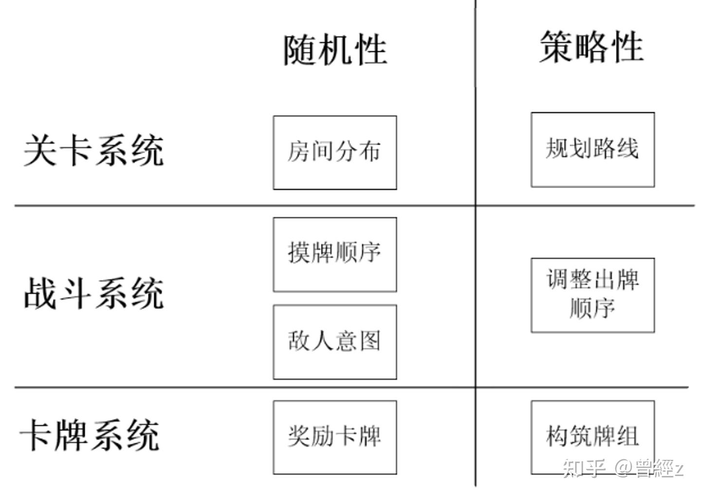
基于此，我们可以得出《杀戮尖塔》的核心体验流，在后文中我们将详细分析体验流中的三大部分。

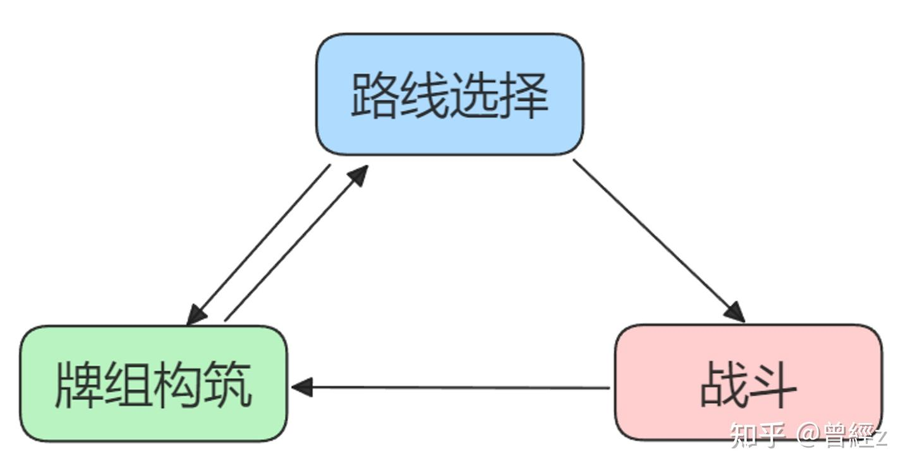

## 2. 战斗系统

### 2.1 战斗系统定位

作为游戏核心体验流中的一环，《杀戮尖塔》中战斗是玩家停留时间最久的部分。战斗系统的设计有着2个目的：

- 对玩家的牌组强度进行反馈
- 满足策略性的要求

### 2.2 战斗画面表现

### 2.2.1 战斗界面概览

《杀戮尖塔》的战斗界面可以分为3个大区。

- 资源区：游戏的常驻UI，在战斗中主要用于查看遗物与药水
- 战斗区：展现敌我状态、敌人意图这两个战斗中最重要的信息
- 卡牌区：与卡牌的交互区域

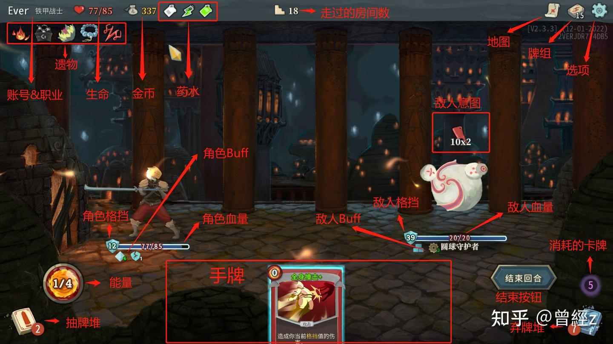

### 2.2.2 卡牌区表现详解

- 回合开始时，能力图标高亮并伴随波动特效，提示玩家能力已恢复。
- 抽牌时，卡牌从抽牌堆逐一移动到手牌区，提示玩家卡牌从抽牌堆抽取。
- 弃牌堆洗为抽牌堆时，会伴随拖尾特效，直观告诉玩家弃牌堆已被洗为抽牌堆

- 当卡牌可被使用时，卡牌被蓝色高光包围。
卡牌不可使用时，蓝色高光消失，卡牌的耗能图标变为红色。

如此设计能够直观的提示玩家哪些牌可以使用。

- 鼠标悬停至卡牌上时，卡牌突出放大，并显示特殊词条的信息
- 使用卡牌时，无需选择目标的卡牌能够直接拖动到战斗区，并自动框选作用对象。
需要选择目标的卡牌，在手牌区居中，并衍生出一个指向战斗区的箭头，玩家拖动箭头选择作用对象。如此设计的目的在于避免卡牌遮挡作用对象。

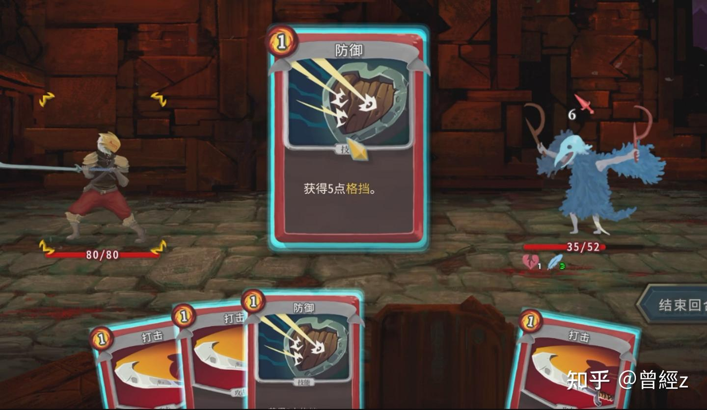

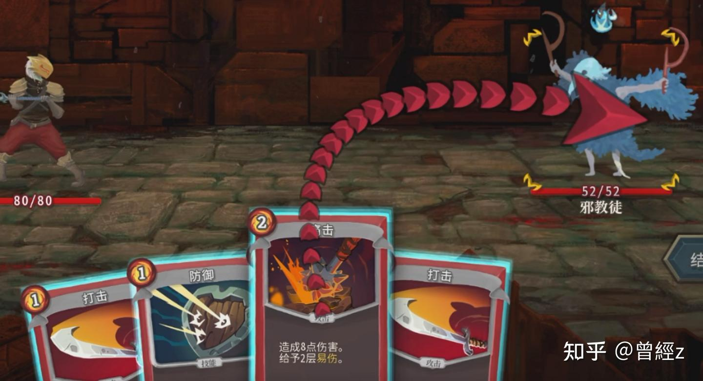
- 卡牌被使用后，能量图标闪动，提示玩家能量被消耗。当能量耗尽时，能量图标将变得暗淡，同时 “回合结束” 按钮将被蓝色高光包围，提示玩家结束回合。
- 使用过的卡牌或回合结束时的手牌，会随动画进入弃牌堆，并带有拖尾特效，直观地提示玩家这些卡牌进入了弃牌堆。

- 回合结束时，按钮上的文字变为“敌方回合”，并在屏幕中央显示“敌方回合”

### 2.2.3 战斗区表现详解

- 使用卡牌对敌人造成伤害时，显示伤害、屏幕抖动、播放打击特效，角色向敌人方向进行一小段位移。位移的目的在于体现是角色对敌人照成了伤害，增加玩家的代入感。

- 添加格挡时，在对象身上展示格挡图标，并将血条变为蓝色，提示玩家格挡已添加。

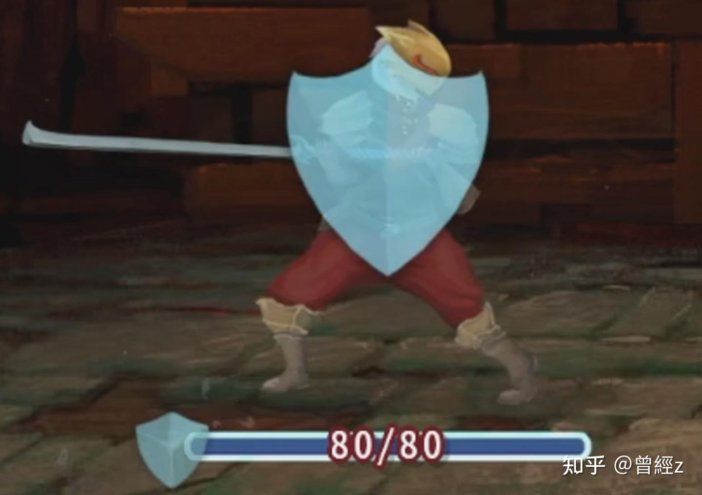
- 当攻击打在格挡上的时候，会显示“格挡”，提示玩家伤害被格挡。
- 回合开始时，格挡图标破碎，格挡消失，血条变回红色
- 添加Buff时，会在对象头顶显示Buff和层数，并在血条下显示Buff图标
- Buff结束时，在对象上方提示Buff结束。

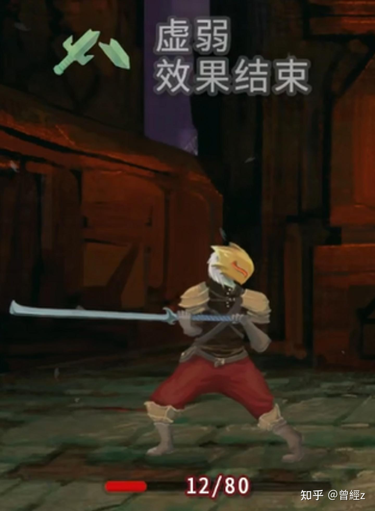

### 2.3 战斗机制

### 2.3.1 战斗主流程

- 失败判定：当角色血量归零时，战斗失败，显示“坏灭”，进入结算。
- 成功判定：当敌方全体血量归零时，战斗成功，进入战利品选择。

### 2.3.2 能量机制

《杀戮尖塔》中战斗的核心目标是：打死对面，不被对面打死

为了实现目标，玩家要进行3种类型的操作：防御、攻击、发育。

而能量机制 限制了玩家的操作次数，使得玩家难以同时实现3种操作，从而不得不进行选择。战斗的策略性便体现在这些选择之中。

同时，能量机制也是平衡卡牌的关键。在 卡牌系统 中我们会再次分析。

### 2.3.3 意图机制

玩家回合开始时，敌人都会预先显示自己的下一个动作（攻击、格挡、特殊行动…），即意图。

游戏的随机性和策略性往往是此消彼长的，随机性高则偏向娱乐，策略性高则偏向硬核。杀戮尖塔作为一款硬核的卡牌游戏，意图机制的设计目的便是牺牲部分随机性，以提高游戏的策略性，给予玩家更多的掌控感。

同类游戏《月圆之夜》中，便没有意图机制，敌人的出牌是无法被提前预知的。因此，《月圆之夜》的策略性会不如杀戮尖塔，但这是其基于自身手游定位做出的合适选择。

### 2.3.4 抽、弃牌机制

使用过的卡牌、回合结束时未使用的卡牌回进入弃牌堆。当抽牌堆被抽尽时，弃牌堆才会被打乱顺序，成为新的抽牌堆。

玩家可以看到抽牌堆中的卡牌，但无法看到抽取的顺序。

一个没有随机性的游戏，很容易索然无味。抽、弃牌机制的设计目的便是为战斗提供一定的随机性。虽然在杀戮尖塔中，随机性并不着重体现在这一部分，但正是因为随机抽牌的存在，玩家才会有精简牌组的动力。从这个角度看，抽、弃牌机制也为检验牌组强度的重要一环。

### 2.3.5 格挡机制

《杀戮尖塔》中角色的血量不会随着普通战斗胜利而恢复，这样设计的目的，在于让玩家不能无脑选择怪物房间来获取卡牌，而是需要权衡获得卡牌和失去血量之间的利弊。

但《杀戮尖塔》中的战斗又十分频繁并且相对困难，如果没有一定的回血机制，游戏将会难以进行。若是回血机制过于强力，又会让血量继承的设计失去作用。因此，设计师选择使用格挡机制，这一无法继承的回血机制来解决这一问题。

格挡每回合消失，是为了避免破坏能量机制，强制玩家分配能量。这样，玩家就无法在某一回合全堆格挡，而将之后回合的能量都分配都别处上。事实上，当抽到卡牌“壁垒”（格挡不会消失）时，很多玩家便是这样做的。

## 3. 卡牌系统

### 3.1 卡牌系统定位

作为核心体验流中最重要的部分，玩家游玩《杀戮尖塔》，很大程度上就是为了构筑一套完美的牌组，以在战斗中做出爽快的操作。

可以说，精妙的卡牌设计决定了《杀戮尖塔》的策略深度和可重复游玩性，撑起了《杀戮尖塔》在卡牌游戏中的地位。

因此，卡牌系统的设计目的为：

- 展现游戏的策略深度
- 构筑游戏的可重复游玩性

### 3.2 卡牌画面设计

### 3.2.1 卡牌信息展现

《杀戮尖塔》的每张牌面都包含了7个信息，按重要程度排序为：

- 插画、名称（用来辨识卡牌），占据了牌面的上半部，是视觉的第一落点。
- 能力（描述卡牌的功能），占据牌面的下半部。
- 耗能（使用卡牌所需消耗的能量），独占左上角的区域，是牌面上最大的字体
- 类型（便于卡牌功能的准确的描述），通过图案框的型抓和小字区分。
- 颜色、稀有度，不做特别说明，仅通过色彩区分
可以看出，每个信息在牌面上的面积和位置，与其重要程度是相关的。

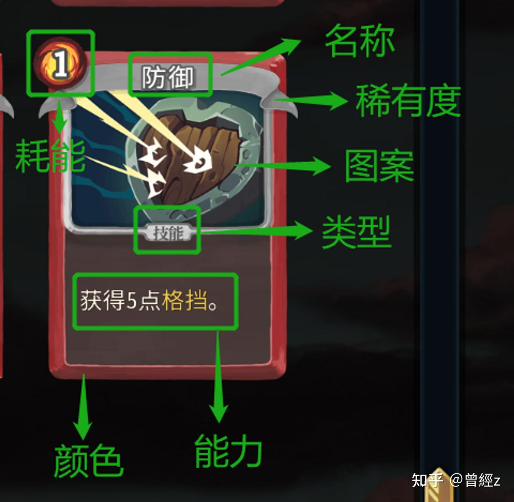

### 3.2.2 提高卡牌辨识度

如果卡面过于趋同，玩家每次使用卡牌时，就得花费更多的精力在辨识卡牌上，从而降低了战斗的流畅度，严重时会将玩家拽出心流。（下图为我参与制作的一款游戏）

为了避免这个问题，杀戮尖塔对卡牌的颜色和内外边框进行了精心设计。

- 不同类型的卡牌，除了文字提示外，还能通过内边框直观知道两张卡牌的类型是否相同。

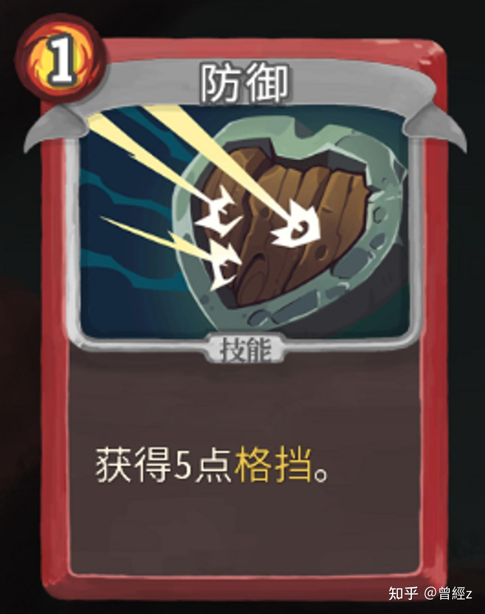

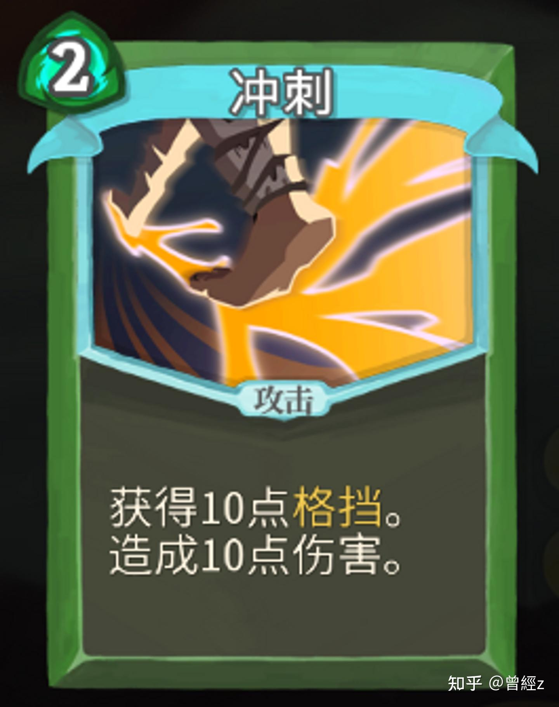
- 不同类型的卡牌，甚至在插画色调上都有很大的不同。如与格挡相关的卡牌呈深蓝色调，与攻击相关的卡牌呈红色调。这样，当卡牌混在一起时，玩家也能一眼方便出每张卡牌大致的作用。

- 不同职业之间的卡牌外框颜色不同，能够给玩家塑造一种差异感，减少了玩家的视觉疲劳。

### 3.3 卡牌设计

基于卡牌系统的定位，《杀戮尖塔》的卡牌设计要考虑2个方面：可重复游玩性和策略性。我们从卡牌的能力维度、卡牌平衡、协同效应 来分析这2个方面。

### 3.3.1 能力维度

我们在战斗系统中分析过，玩家在《杀戮尖塔》中的三大操作分别是：防御、攻击、发育。《杀戮尖塔》中的卡牌能力维度正是对应了这三大操作：

- 防御维度：和游戏失败条件直接挂钩的维度，是最重要的维度。
- 攻击维度：和游戏成功条件直接挂钩的维度，是次重要的维度。
- 发育维度：加强防御和攻击维度的维度，属于辅助维度。
《杀戮尖塔》会考验玩家牌组的每一个维度。如第一层中的三个精英怪：乐加、地精、哨卫，就分别考验防御维度、攻击维度、发育维度的能力：

- 乐加在苏醒后的两回合进行重击，每次重击造成18点伤害。配合上三者中最高的血量（108）点，使得玩家几乎必定要面对这两击。如果防御端的能力不够，36点伤害将会令人十分难受。
- 地精在玩家打出技能牌时，会增加力量。而大部分防御端的牌都属于技能牌，因此玩家只能尽可能快的把他击杀，避免其不断发育。因此，地精考验着玩家的进攻端能力。
- 哨卫会在玩家的牌组中临时添加 眩晕牌，污染玩家的牌库。要是玩家缺少过牌（属于发育维度）的能力，很可能无法拿到有用的卡牌。反之，如果玩家发育维度足够强大，甚至可以将眩晕牌用于发育，化Debuff为buff。
不仅仅考验单一能力维度，目的在于增加玩家考虑的方面，从而增加游戏的策略性。而且，这种复杂并非是传统MMO中满屏UI的那种复杂，增加的不是学习成本而是精通成本，即易上手、难精通。

下图是战士的所有卡牌，不难看出，攻击维度所占的卡牌最多（46张），防御维度（21张）和发育维度（29张）其次。

其中，有17张卡牌是直接跨维度的，还有不少卡牌通过协同效应也实现了跨维度（后文中将详细分析）。这样的设计又增加了玩家同时发展三大维度的灵活性，使得游戏不那么死板。

### 3.3.2 卡牌平衡

平衡是一切策略游戏的重中之重，是可重复游玩性的保证。策略游戏一但出现一个最优解，那么与此解无关的一切设计，都可能变为玩家难以体验到的部分，游戏也会迅速变得枯燥无味。

除了利用对三大能力维度的综合考验，来限制玩家无脑堆某一维度外，《杀戮尖塔》还利用一套标准值偏移法，控制着卡牌的平衡。

《杀戮尖塔》在设计卡牌时，有一套标准值：

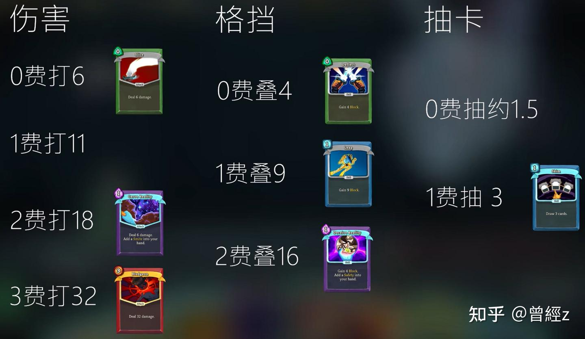
每张卡牌都是标准值上进行某种偏移得到的，偏移方式有3种：

- 增加正面效果，减少资源价值。如顺劈斩 资源价值为1费打7，小于标准值1费打11，原因是增加了正面效果：对敌方全体生效。
- 增加负面效果，提高资源价值。如硬撑 资源价值为1费叠15，高于1费叠9的标准值，但会向牌组里增加两张伤口，污染牌库。
- 增加触发条件，提高资源价值。如 交锋 资源价值为0费打14，甚至高于了1费的标准值。但其的触发条件“手中每张都是攻击牌时才可打出”，使玩家若想打出这种手牌，需要进行一定的布局。
如此大费周章地控制单卡的平衡，就是为了降低游戏的运气成分。这样，一来避免玩家抽到某张出奇强力的卡后，可以不动脑子直接通关。二来减少了游戏难度因随机性的波动，给熟练的玩家无时无刻的掌控感。

### 3.3.3 协同效应

由于严格的平衡控制，《杀戮尖塔》中的大多数单卡的强度都被控制在标准值附近。相似的强度很容易使玩家缺失成长感，甚至会减少策略性——毕竟都差不多，随便选就好了。

为了避免此类情况，《杀戮尖塔》设计了卡牌间的协同效应（synerge)。如果说为了卡牌平衡进行的标准值偏移是上锁，那么协同效应就是对应的解锁。因此，协同效应也分为3种：

- 抵消卡牌的负面效果：如 坚毅 的负面效果“消耗一张手牌”，和 硬撑 的负面效果“伤口”，就可以相互抵消。从而完全吃到标准值偏移时提高资源价值的红利，使卡牌强度超出标准值。
- 达到卡牌的触发条件：如 撕裂 的增益需要由主动扣血来触发，而 御血术 就是最一个主动扣血的卡牌。因此，可以使用 御血术 来触发 撕裂，使卡牌强度超出标准值。
- 放大卡牌的正面效果：如 重刃 的正面增益 ”受到力量的加成*3“, 使得其可以与任何提供力量的卡牌形成协同效应，从而放大正面增益，使卡牌强度超出标准值。
一次协同效应分为四个部分，即输入端→输入资源→输出端→输出资源。如 防御→格挡→全身撞击→伤害。

多个协同效应可以相互连接，即 输入端→输入资源→协同1输出端→协同1输出 →协同2输出端→协同2输出。如：御血术→扣血→撕裂→力量→重刃。

再看战士体系中的数量庞大的协同效应。我们可以发现2个设计要点：

- 通过 控制输入资源和输出资源的种类（紫色方块），让很多协同效应交叉在一起。即输入端可以是很多张不同的卡牌，输出端同理。这样的设计大大增加了牌组构筑的灵活度，同样也降低了游戏的运气成分，让玩家几乎不可能凑不出协同效应，区别只在于强度。
- 很多协同效应都是跨能力维度的。强力的卡组往往是利用了这种协同效应，仅仅使用1、2张卡牌就可以撑起某一非核心能力维度。
卡牌系统是《杀戮尖塔》的核心，协同效应是卡牌系统的核心，也就成为了《杀戮尖塔》的灵魂，撑起了游戏的策略深度和可玩性。

## 4. 关卡系统

### 4.1 关卡系统定位

除了作为连接战斗与牌组构筑的桥梁，《杀戮尖塔》的地图还肩负起了Rogue元素体现。因此，其关卡系统有着2个设计目的：

- 控制游戏的难度曲线
- 足够的随机性

### 4.2 关卡画面表现

《杀戮尖塔》的地图为上下滚动，玩家从地图下策向上侧移动，符合背景故事中爬塔的设定。

《杀戮尖塔》的地图界面十分简洁，仅有5个元素：

- 已走过的房间数：便于玩家判断本层的剩余房间数
- 本局游玩时间
- 房间图标：分为3类
- 已走过的房间将被圈起，便于快速定位。
- 可前往的房间和已走过的房间的饱和度将被拉高，便于识别。
- 不可前往的房间的饱和度将被拉低，直观告诉玩家此处不可探索。
- 路线：房间图标之间的连接线，预示着玩家将会经过的房间。
- 图例：除给予玩家阅读参考外，当鼠标悬停在图例上的某个图标时，还会在地图上高亮此类房间，便于玩家规划路线。

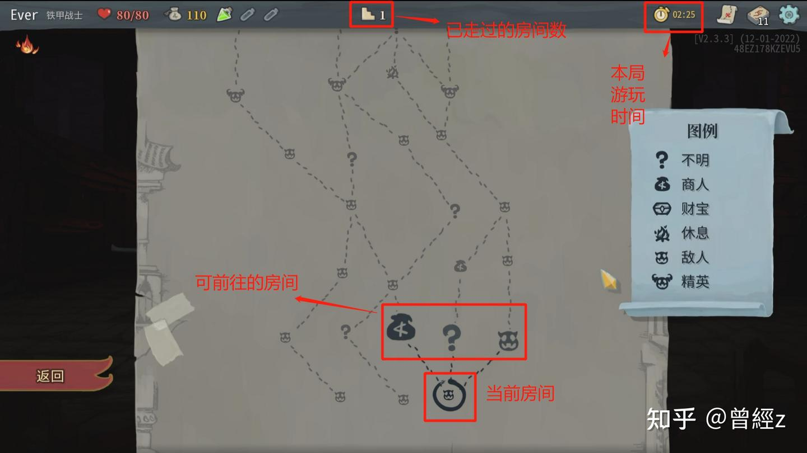

### 4.3 地图设计

### 4.3.1 房间种类

《杀戮尖塔》中一共有6种房间。

- 敌人房间：玩家在此与普通敌人战斗，胜利后获得卡牌、金币，40%概率获得一瓶药水。
- 精英房间：玩家在此与精英敌人战斗，胜利后额外获得一个随机遗物并增加得分。并且更容易获得高稀有度的卡牌。
- 休息房间：玩家在此恢复30%血量或升级卡牌。有3件遗物可以增加休息处的功能选项：
- 壶铃：使每场战斗开始时获得1点力量，最多使用3次。
- 宁静烟斗：删除1张卡牌
- 铲子：获得一个遗物
- 财宝房间：玩家在此获得一件遗物，有概率获得一些金币。

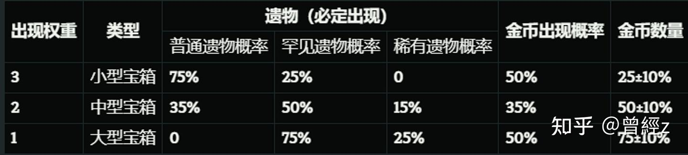
- 商店房间：玩家在此使用金币购买物品和服务，根据物品稀有度不同，售价不同：
- 5张与角色对应的有色卡牌：分别为2张攻击牌、2张技能牌、1张能力牌。并且，5张牌中将有一张以五折出售。
- 2张无色卡牌：1张罕见，1张稀有。
- 3件遗物：至少有1件为商店遗物。
- 3瓶药水
- 卡牌移除服务：初始价格为75，每移除次涨价25.每个商店仅可购买1次。

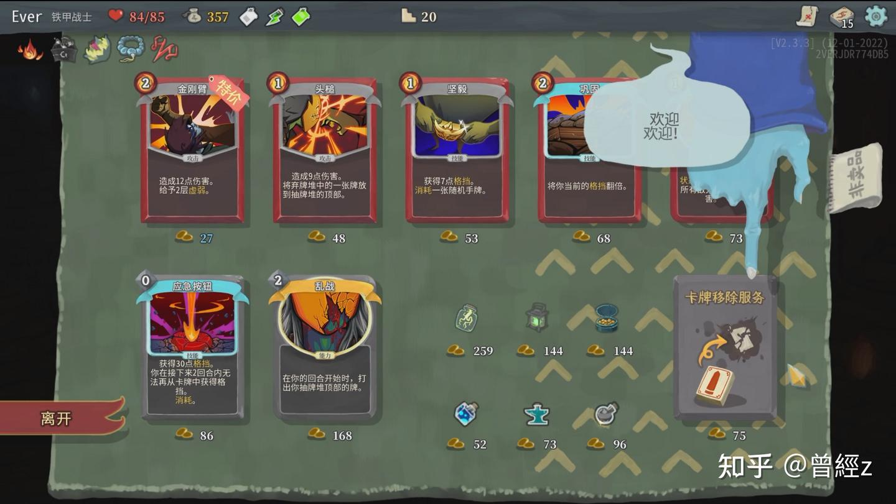
- ？房间：玩家在？房间中可能遭遇事件、敌人、财宝、商店。后三者的触发概率有一定的机制：

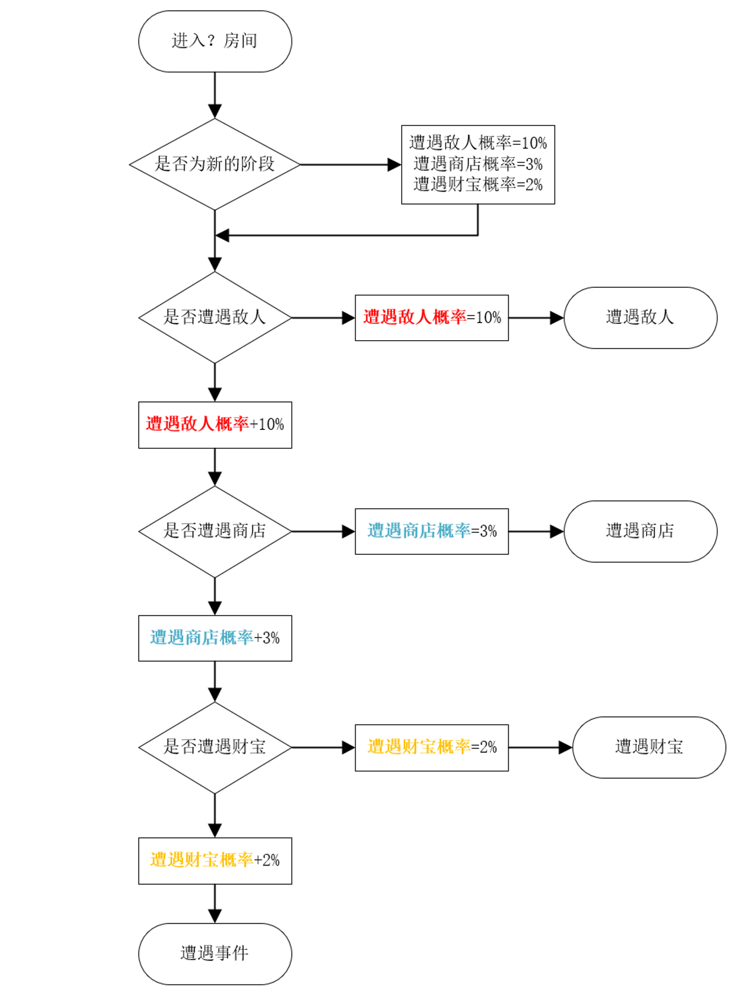
- 敌人、商店、财宝的初始概率为10%，2%，3%。
- 进入？房间时，若未被触发，则其触发概率增加，增加的概率和初始概率相等。如3次都为触发敌人，那么下次进入？房间，遇到敌人的概率将是40%（10%+3*10%）
- 击败Boss或被触发后，概率重置为初始概率。如第4次进入？房间时，在40%的概率下遇到了敌人，那么第5次进入？房间，遇到敌人的概率为10%。

### 4.3.2 房间数量

《杀戮尖塔》中每种房间的数量很有考究。

下图是3局不同游戏的第一层的房间分布

统计出不同房间的数量

可以十分直观地看出，每种房间的数量占比在每局游戏中十分接近，大致为 5战斗：3安全：2未知。

战斗是考验玩家的唯一方式，即挑战；安全和未知则是牌组构筑的过程，即玩家能力的增长。如此的房间数量分配使得挑战与能力增长平衡，从而利于玩家进入心流。

同时，战斗还是卡牌最主要的来源。大量的战斗保证了玩家有足够多的机会拿到卡牌，是围绕卡牌构筑的必要设计。

并且，我们可以看到未知房间是数量第二多的房间。这是为了增加游戏的随机性，使得游戏不那么千篇一律，也降低了标准答案的出现，增加了游戏的可重复游玩性。

### 4.3.3 路线设计

从这张图，我们可以发现一些房间分布规律：

- Boss之前一定是休息。
走到这一步的玩家无非4种情况：

其中，1玩家是最容易退出游戏的，4玩家反之。因此，我们要想办法将2、3种玩家拉向第4种。此处的休息房间便是这个作用。

- 第1步为1~5个敌人房间
- 前5步不会遇到精英房间。因为此时玩家的牌组还在探索期，不应这么快给予挑战。
- 除敌人和未知房间外，别的房间不会连续出现。
- 连续的两个精英房间过于困难
- 连续的两个篝火或财宝会使玩家成长过快，导致紧接着的几个敌人房间失去挑战性；
- 连续的两个商人，玩家进入第二个商店时会缺少金币购买物品，从而失去意义。
- 第9步一定是财宝（蓝色）。这样的设计使得地图可以分割为上下两部分，即收束再发散，便于了关卡节奏的控制。
- 每个房间最多可由3个房间导入，最多可导向3个房间。其中，只导向1个房间的房间最多，导向3个房间的房间最少。

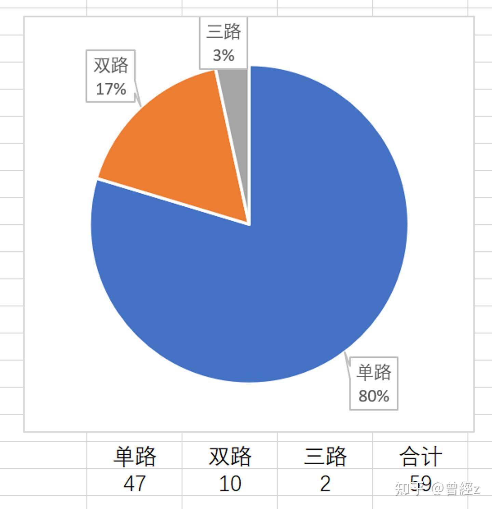
由于最后1点，即岔路的存在，《杀戮尖塔》中的路线数量极其庞大。如下图，虽然玩家只能行走15步，但就有192种路线选择。

面对如此庞大的可能性，《杀戮尖塔》还是很好地控制了每一种可能性的关卡节奏。

以第9步的宝箱为分界点，我抽出了几条路线，进行统计（下图分别为上半和下半）。

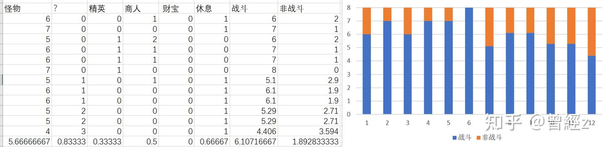
可以看出，下半的战斗比例明显高于上半。

这是由于战斗是卡牌最最主要的来源，如此设计的目的就在于让玩家快速估计牌组的方向，提升牌组强度，以面对本层的Boss。也就是说，玩家在下半的主要任务是构建卡组，在上半的主要任务是面对Boss。

同时，我们统计出整条路线（15步）中战斗与非战斗的占比期望，可以得到如下数据：

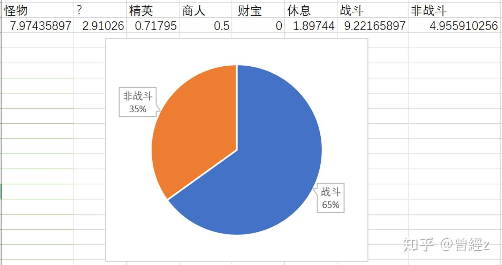
这个比例（35/65 = 0.54）与整个地图中战斗房间与非战斗房间的比例（28/52=0.54）十分接近，进一步让我们理解了房间数量分布的意义。

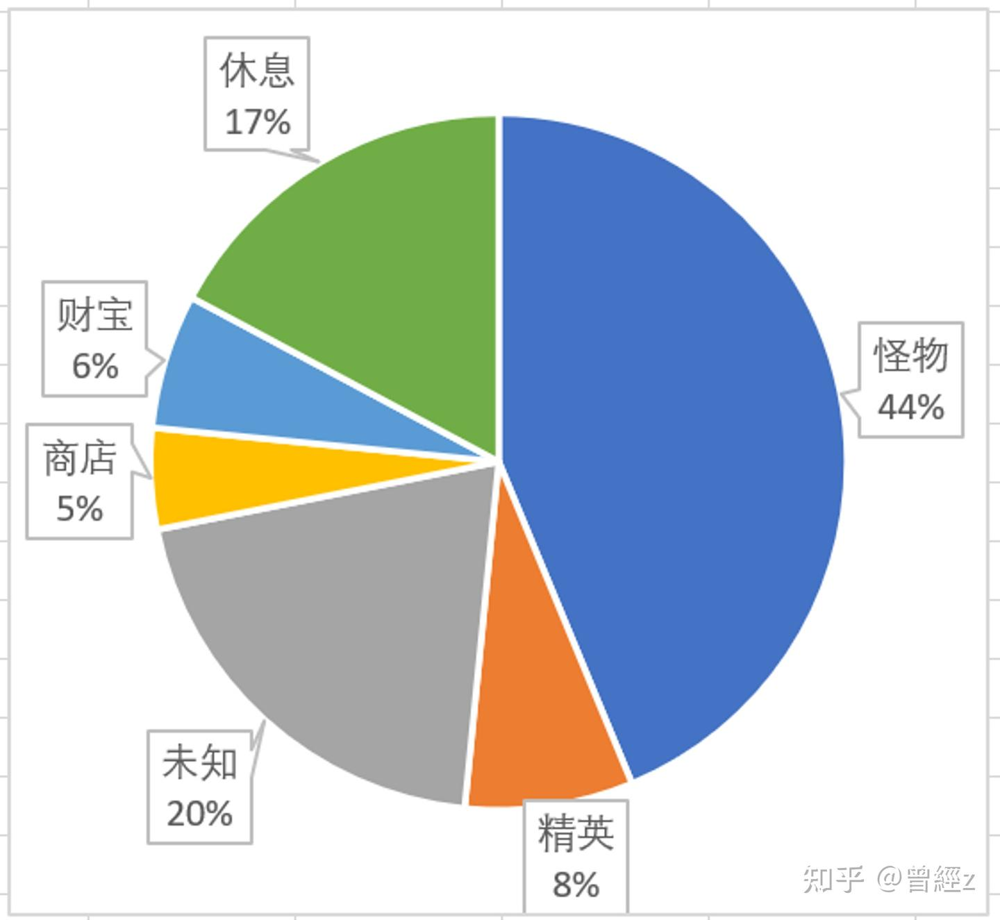

## 5. 总结

《杀戮尖塔》之所以为经典，其许多设计对我们有着深刻的启发。

比如战斗中如何通过高亮和动画，而不通过文字来交代战斗信息、引导玩家。

比如设计卡牌时，可以通过标准值法来控制卡牌的平衡。通过能力维度来设计卡牌的效果。

再比如设计关卡时，通过收束与发散，来减少设计的难度，以更好控制关卡节奏。

> 圖說：我参与制作的一款游戏的关卡草稿

总而言之，《杀戮尖塔》是一跨十分值得分析与学习的游戏。通过对《Slay the Spire》的设计进行拆解，我不禁感叹于其卓越的创意和精湛的执行，也为日后设计卡牌游戏，提供了宝贵的经验和灵感。

